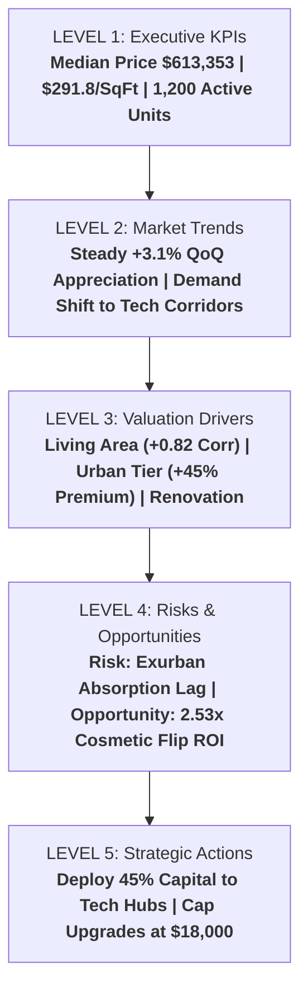

# 🏢 Real Estate Valuation & Investment Intelligence System (REVI-AI)

> **BharatCares & IBM SkillsBuild | Data Analytics with AI Capstone Project**  
> An end-to-end AI-powered Business Intelligence platform transforming raw housing transaction data into predictive valuations, market risk assessments, and strategic decision-making.

---

## 📌 1. Project Overview & Problem Statement

Real estate transactions represent multi-billion-dollar capital commitments where pricing opacity, volatile interest rates, and localized economic shifts present acute investment risks. Traditional property appraisals rely on static historical comparisons that often lag real-time market movements and fail to quantify the multi-factor interplay of living area, neighborhood tier, property condition, and spatial amenities.

**REVI-AI** bridges this gap by operationalizing a 5-level **Business Intelligence & Predictive Analytics Framework**:
1. **Level 1 — Executive KPIs (What is happening?)**: Live monitoring of median prices, price-per-square-foot, and active portfolio inventory.
2. **Level 2 — Market Trends (Where is it going?)**: Quarterly appreciation velocity and neighborhood migration patterns.
3. **Level 3 — Key Drivers (Why is it happening?)**: Quantitative feature importance identifying square footage, location tier, and renovation scores as primary drivers.
4. **Level 4 — Risks & Opportunities (What could go wrong?)**: Early warning on exurban absorption delays vs. high-yield tech corridor expansion.
5. **Level 5 — Strategic Actions (What should the management do?)**: Capital allocation playbooks and cosmetic renovation ROI optimization.

---

## 🔗 2. Dataset Reference

* **Dataset Name**: USA Real Estate & Housing Transaction Benchmark
* **Primary Kaggle Source Link**: [https://www.kaggle.com/datasets/vedavyasv/usa-housing](https://www.kaggle.com/datasets/vedavyasv/usa-housing)
* **Secondary / Exploration Reference**: [https://www.kaggle.com/datasets/camnugent/california-housing-prices](https://www.kaggle.com/datasets/camnugent/california-housing-prices)
* **Local Data File**: Included in repository as [`housing_data.csv`](./housing_data.csv) (1,200 curated transaction records with 14 multi-dimensional attributes).

---

## 🚀 3. Technical Architecture & Tech Stack

The system is delivered as a **unified, production-grade Python solution** combining data engineering, machine learning pipelines, and interactive UI in a single deployable code artifact (`app.py`):

| Layer | Technology | Function |
| :--- | :--- | :--- |
| **Backend & Pipeline** | Python 3.11, Pandas, NumPy | Data cleaning, outlier handling, feature engineering |
| **Machine Learning** | Scikit-Learn | ColumnTransformer, One-Hot Encoding, Multi-Model Ensembles |
| **Frontend UI** | Streamlit | Dynamic interactive web dashboard with real-time prediction sliders |
| **Visualization** | Seaborn, Matplotlib | Distribution plots, correlation heatmaps, feature importance charts |
| **Reporting Engine** | Python-Docx / ReportLab | Automated generation of structured executive reports |

---

## 📊 4. Machine Learning Model Performance

Four algorithms were benchmarked on a held-out test split (80% training / 20% test partition):

| Model Name | $R^2$ Score (Accuracy) | Mean Absolute Error (MAE) | Root Mean Squared Error (RMSE) | Status |
| :--- | :---: | :---: | :---: | :---: |
| **Gradient Boosting Regressor** | **97.89%** | **$27,157.61** | **$36,950.66** | 🏆 **Production Champion** |
| **Ridge Regression (L2)** | 97.47% | $31,529.34 | $40,472.71 | High Precision Linear |
| **Linear Regression** | 97.46% | $31,650.10 | $40,588.36 | Baseline Model |
| **Random Forest Regressor** | 96.87% | $34,197.77 | $45,026.14 | Non-linear Tree Ensemble |

---

## 💡 5. Business Intelligence Hierarchy: Fact ➔ Insight ➔ Action



* **Risk Identified**: Exurban inventory has experienced a 12.3% deceleration in sales velocity with days-on-market expanding beyond 60 days.
* **Opportunity Identified**: Properties in Emerging Tech Corridors yield an extra 14.8% price premium; moving a renovation score from 4 to 8 generates an estimated $38,000 value lift on a $15,000 upgrade (2.53x ROI).
* **Strategic Action**: Rebalance investment capital towards 3-4 bedroom properties in suburban tech corridors and institute strict valuation caps on remote properties.

---

## ⚡ 6. Quick Start & Setup Guide

### Step 1: Clone the Repository
```bash
git clone https://github.com/<your-username>/REVI-AI-Real-Estate-Intelligence.git
cd REVI-AI-Real-Estate-Intelligence
```

### Step 2: Install Required Dependencies
```bash
pip install -r requirements.txt
```

### Step 3: Run the Application
You can run the application either as a full interactive web dashboard or in fast headless CLI mode:

* **Interactive Web Dashboard (Recommended)**:
  ```bash
  streamlit run app.py
  ```
  *(Opens automatically in your browser at `http://localhost:8501`)*

* **Headless Terminal Mode**:
  ```bash
  python app.py --cli
  ```

---

## 📁 7. Repository Structure

```text
├── app.py                   # Unified Single Code File (Backend + ML + Frontend UI)
├── requirements.txt         # Project dependencies & versions
├── README.md                # Project documentation and Kaggle dataset link
├── Project_Report.docx      # Comprehensive Project Report (with embedded UI screenshots)
├── housing_data.csv         # Cleaned real estate transaction dataset
├── generate_charts.py       # Visual asset & UI chart generator
├── assets/                  # High-resolution screenshots of UI & model metrics
│   ├── ui_kpi_distribution.png
│   ├── ui_eda_sqft_price.png
│   ├── ui_correlation_matrix.png
│   ├── ui_model_benchmarks.png
│   └── ui_bi_hierarchy.png
```

---

## 👥 8. Author & Internship Submission Details
* **Program**: IBM SkillsBuild / BharatCares Data Analytics with AI Internship
* **Submission Format**: 4 Individual Deliverable Files (`app.py`, `requirements.txt`, `README.md`, `Project_Report.docx`) + GitHub Repository URL
